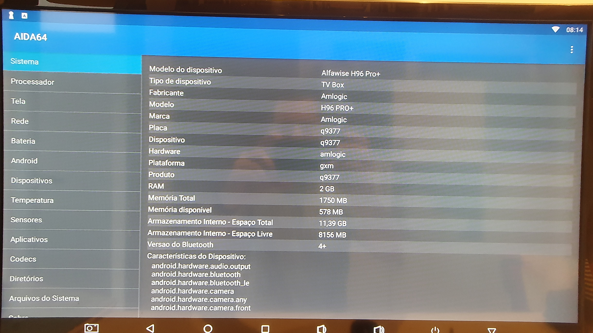

# TV Box H96 Pro+

## Especificações originais

- Marca: Alfawise
- Modelo: H96Pro+
- CPU: S912
- Memória: 2GB / 16GB Flash
- Sistema Operacional: Android 7.1
- Voltagem: 5V DC



## Instalando o Linux (método 1)

- Remover todas as partições do cartão de memória a ser utilizado no processo. Criar uma nova partição FAT32;

- Gravar a imagem [Armbian_20.05.4_Arm-64_buster_current_5.7.0-rc6_desktop_20200518.img.xz](https://www.dropbox.com/scl/fi/k2zebv606o0nggtccorg1/Armbian_20.05.4_Arm-64_buster_current_5.7.0-rc6_desktop_20200518.img.xz?rlkey=sthq0cpt3r3dl6gpw0di1kkbu&dl=0) no **cartão de memória** usando o aplicativo [balenaEtcher](https://www.dropbox.com/s/airlf91bq0633wb/balenaEtcher-Setup-1.7.9.zip?dl=0);

- Remover o cartão de memória com segurança e inserir novamente no PC;

- Editar o arquivo \uEnv.txt no cartão de memória e deixar o conteúdo da seguinte forma:

```txt
LINUX=/zImage
INITRD=/uInitrd

# aml s9xxx
FDT=/dtb/amlogic/meson-gxm-q200.dtb
APPEND=root=LABEL=ROOTFS rootflags=data=writeback rw console=ttyAML0,115200n8 console=tty0 no_console_suspend consoleblank=0 fsck.fix=yes fsck.repair=yes net.ifnames=0
```

- Remover o cartão de memória com segurança;

- Inserir o cartão de memória na TV-Box e ligá-la;

- Acessar inicialmente com usuário **root** e senha **1234**;

- Alterar a senha do usuário **root** para **jedi1234**;

- Criar o usuário **user** com a senha **jedi1234**;

- Executar o aplicativo **armbian-config** para definir o time zone para **America/Campo_Grande** e o nome do host como **home-assistant-jedi**;

- Remover monitor, teclado e mouse da TV-Box e reiniciá-la;

- Abrir uma janela de prompt de comando no PC e acessar a TV-Box com o comando **ssh root@home-assistant-jedi**;

- Atualizar o Linux com os seguintes comandos:

```bash
apt update --fix-missing
apt upgrade
```

- Instalar o Linux na memória interna da TV-Box com o seguinte comando:

```bash
./install-aml.sh
```

- Executar o comando **shutdown now** para desligar a TV-Box. Desligar o cabo de exergia da TV-Box, remover o cartão de memória e religá-la.

## Instalando Home Assistant Container

```bash
apt install apparmor jq wget curl udisks2 libglib2.0-bin network-manager dbus lsb-release systemd-journal-remote -y
```

```bash
curl -fsSL get.docker.com | sh
```

```bash
docker run -d --name homeassistant --privileged --restart=unless-stopped -e TZ=America/Campo_Grande -v /home/homeassistant:/config --network=host ghcr.io/home-assistant/home-assistant:stable
```

- A partir de um PC na mesma rede em que estiver a TV-Box, acessar **http://home-assistant-jedi:8123/**;

- Criar o usuário **admin** com senha **jedi1234**.

### Instalando HACS

- Executar os comandos a seguir:

```bash
docker exec -it homeassistant bash
```

```bash
wget -O - https://get.hacs.xyz | bash -
```

- Reiniciar o Home Assistant;

- Instalar a integração HACS no Home Assistant.

## Unbrick

- [Unbrick](./unbrick/readme.md)

## Comandos Linux úteis

- Mostrar a versão da distribuição do Linux:

```bash
cat /etc/os-release
```

## Referências

- [Instruções de instalação](https://forum.armbian.com/topic/27825-proper-way-to-install-armbian-linux-on-h96-pro-plus-s912-or-equivalent-cli-ver/);
- [Atualização do Python](https://computingforgeeks.com/how-to-install-python-on-debian-linux/).
