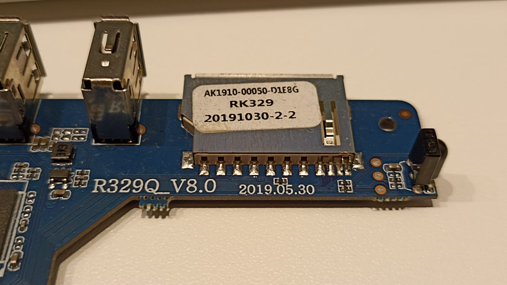
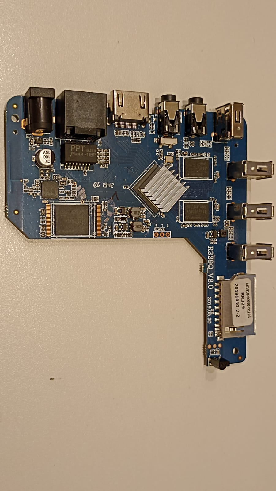

# TV Box MX9 5G

## Especificações originais

- Modelo: 
- CPU: RK329Q_V8.0
- Memória: 3GB / 32GB Flash
- Sistema Operacional: Android 9.0
- Voltagem: 5V / 2.0A





## Instalando o Linux

### Sites de referência

1. [Armbian](https://www.armbian.com/);
2. [Download](https://www.armbian.com/download/?device_support=Supported);
3. [RK322X](https://forum.armbian.com/topic/12656-csc-armbian-for-rk322x-tv-boxes/) (compatível com MX9 5G).

### Instalando o Linux

1. Utilizar a imagem do utilitário [Multitool](https://www.dropbox.com/scl/fi/5hobx8t6v74uqrkcdd0mw/multitool.img.xz?rlkey=5iv2n239cdiqk03i8zbbifyi3&dl=0);
2. Utilizar a imagem do linux [Armbian_23.5.1_Rk322x-box_bookworm_current_6.1.30.img.xz](https://www.dropbox.com/scl/fi/ki1av7pwmq5rxkkkpa3y0/Armbian_23.5.1_Rk322x-box_bookworm_current_6.1.30.img.xz?rlkey=v94hdqhp9z0ftwwpkuln0vjzb&dl=0);
3. Gravar a imagem do Multitool em um cartão de memória usando o aplicativo [balenaEtcher](https://www.dropbox.com/s/airlf91bq0633wb/balenaEtcher-Setup-1.7.9.zip?dl=0);
4. Copiar a imagem do linux na pasta **images** do cartão de memória;
5. Inserir o cartão de memória na TV Box;
6. Conectar um teclado USB na TV Box. Utilizar uma das portas USB que ficam perto da entrada do cartão de memória;
7. Conectar um monitor na TV Box;
8. Conectar a TV Box na energia;
9. O led azul na frente da TV Box deve piscar;
10. A interface do Multitool deve aparecer no monitor (talvez seja necessário gravar as imagens no cartão de memória mais de uma vez!);
11. Instalar a imagem na TV Box;
12. Definir parâmetros iniciais do sistema;
13. Definir IP fixo com o comando **armbian-config**;
14. Atualizar o linux.

### Instalando o Home Assistant Core

1. Executar os comandos a seguir:
```bash
pip install --upgrade pip
sudo apt-get install build-essential libssl-dev libffi-dev python3-dev cargo pkg-config
```

2. Siga os passos da página oficial de instalação do [Home Assistant Core](https://www.home-assistant.io/installation/linux#install-home-assistant-core).

### Configurando Home Assistant como serviço

```bash
ps -p 1 -o comm=
sudo nano /etc/systemd/system/home-assistant@homeassistant.service
```
```
[Unit]
Description=Home Assistant
After=network-online.target

[Service]
Type=simple
User=%i
WorkingDirectory=/home/%i/.homeassistant
ExecStart=/srv/homeassistant/bin/hass -c "/home/%i/.homeassistant"
Restart=on-failure
RestartSec=5s

[Install]
WantedBy=multi-user.target
```
```bash
sudo systemctl --system daemon-reload
sudo systemctl enable home-assistant@homeassistant
sudo systemctl start home-assistant@homeassistant
sudo systemctl status home-assistant@homeassistant
```