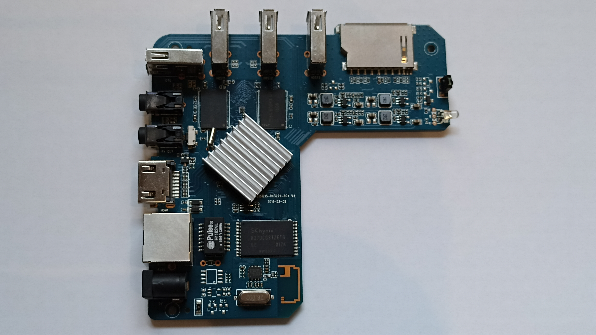
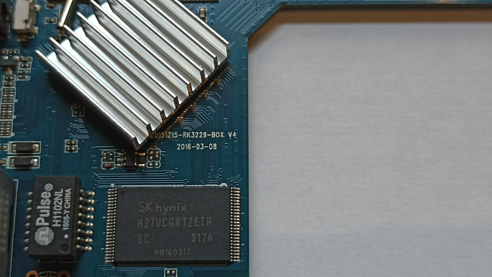

# TV Box MXIII 4K

## Especificações originais

- Modelo: MXIII 4K
- CPU: RK-3229-BOX V4





## Instalando o Linux

### Sites de referência

1. [Armbian](https://www.armbian.com/);
2. [Download](https://www.armbian.com/download/?device_support=Supported);
3. [RK322X](https://forum.armbian.com/topic/12656-csc-armbian-for-rk322x-tv-boxes/) (compatível com MXIII 4K).

### Preparando a instalação do Linux

1. Utilizar a imagem do utilitário [Multitool](https://www.dropbox.com/scl/fi/5hobx8t6v74uqrkcdd0mw/multitool.img.xz?rlkey=5iv2n239cdiqk03i8zbbifyi3&dl=0);
2. Utilizar a imagem do linux [Armbian_23.5.1_Rk322x-box_bookworm_current_6.1.30.img.xz](https://www.dropbox.com/scl/fi/ki1av7pwmq5rxkkkpa3y0/Armbian_23.5.1_Rk322x-box_bookworm_current_6.1.30.img.xz?rlkey=v94hdqhp9z0ftwwpkuln0vjzb&dl=0);
3. Gravar a imagem do Multitool em um cartão de memória usando o aplicativo [balenaEtcher](https://www.dropbox.com/s/airlf91bq0633wb/balenaEtcher-Setup-1.7.9.zip?dl=0);
4. Copiar a imagem do linux na pasta **images** do cartão de memória;
5. 
### Instalando o Linux

1. Inserir o cartão de memória na TV Box;
2. Conectar um teclado USB na TV Box. Utilizar uma das portas USB que ficam perto da entrada do cartão de memória;
3. Conectar um monitor na TV Box;
4. Conectar a TV Box na energia;
5. O led azul na frente da TV Box deve piscar;
6. A interface do Multitool deve aparecer no monitor (talvez seja necessário gravar as imagens no cartão de memória mais de uma vez!);
7. Instalar a imagem na TV Box usando a opção "Install Armbian via steP-nand;
8. Desligar a TV Box;
9. Remover o cartão de memória.

### Configurando o Linux

#### Atualizando o sistema

```bash
apt update
apt upgrade
```

#### Definindo o timezone

```bash
timedatectl
timedatectl list-timezones | grep Campo_Grande
timedatectl set-timezone America/Campo_Grande
```

#### Definindo o IP estático

1. Definir nome do host como **home-assistant** usando o comando **armbian-config**;
2. Reiniciar a TV Box.

### Instalando Home Assistant Container

```bash
apt install apparmor jq wget curl udisks2 libglib2.0-bin network-manager dbus lsb-release systemd-journal-remote systemd-resolved -y
```

```bash
curl -fsSL get.docker.com | sh
```

```bash
docker run -d --name homeassistant --privileged --restart=unless-stopped -e TZ=America/Campo_Grande -v /home/homeassistant:/config --network=host ghcr.io/home-assistant/home-assistant:stable
```

Just use the multitool to backup your current installation if you want to. We are going to erase everything on the NAND so if you want to keep the content just do a quick backup.

I suggest you to install from scratch, but if you spent time to do some configurations you don't want to lose again, the multitool will make your life easier.

 

What you need:

from the ilmich/rkflashtool you need to clone/download the repository and compile the binary using the instructions there.
 

The procedure (if you are already in maskrom mode, go directly to step 8):

Do the backup using the Multitool
Do "Erase Flash" using the Multitool
Unplug the power cord, detach all unnecessary things: no network, no hdmi, no sdcard, no power cord and no USB things; if serial adapter is attached, keep only ground and TX wires (stock bootloader uses 1.5mbps speed)
Connect the USB male-to-male cable to the computer and then to the USB OTG port of the box
The box should turn on automatically, you should see a device with ID 2207:320b running lsusb command
Erase the flash bootloader: invoke the command rkflashtool e 0 8192 and wait a few seconds
Now we have to put the the board in maskrom mode: unplug the USB cable, wait a few seconds and replug the USB cable. If you don't see anything on serial adapter and the device is listed in lsusb, you are in maskrom mode! As an alternative to unplug/replug, you can also run rkflashtool b 3, but it is preferred to do a power cycle.
If you have a serial adapter attached, depending on the loader, you may need to set the speed to 1500000bps or 115200bps to see the box output.
Upload the loader to the board: rkflashtool l bin/rk322x_loader_v1.10.238_256.bin
Update the loader on the board: rkflashtool a bin/rk322x_loader_v1.10.238_256.bin
Unplug the USB cable
Done!
 

If you are at step 9 and rkflashtool is stuck at "info: send ddrbin vendor code", do a power cycle and use the alternative 1T bootloader: bin/rk322x_loader_v1.10.238_256_1t.bin

You can now restore the backup using the multitool (or do a new installation).

 

Note: I also attached to this post a couple of known working bootloaders in case the one I suggested above does not work and you need to restore back the functionality of your board.

Use them if the one above does not work.