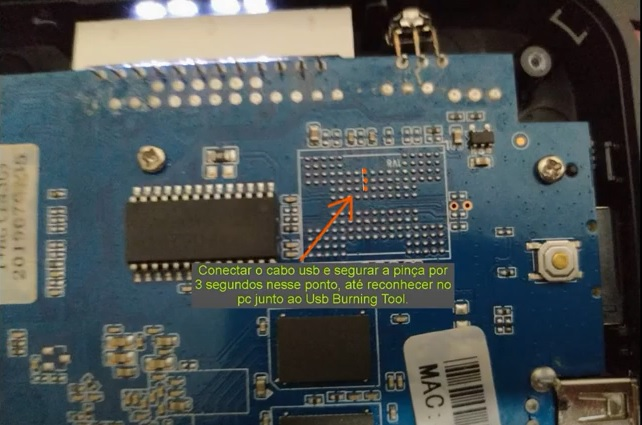

# Unbrick TX9

1. Desmontar aparelho;

2. Conectar o cabo USB (na porta mais perto do botão reset) e fazer contato com uma pinça por 3 segundos no ponto 
destacado na imagem a seguir, até reconhecer no PC junto ao USB Burning Tool;

3. No USB Burning Tool, acessar **File** > **Import Image** e selecionar a imagem a ser gravada no dispositivo;

4. Desmarcar o campo **Erase Bootloader**;

5. Clicar em **Start**.